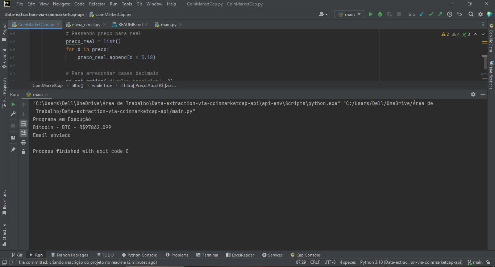
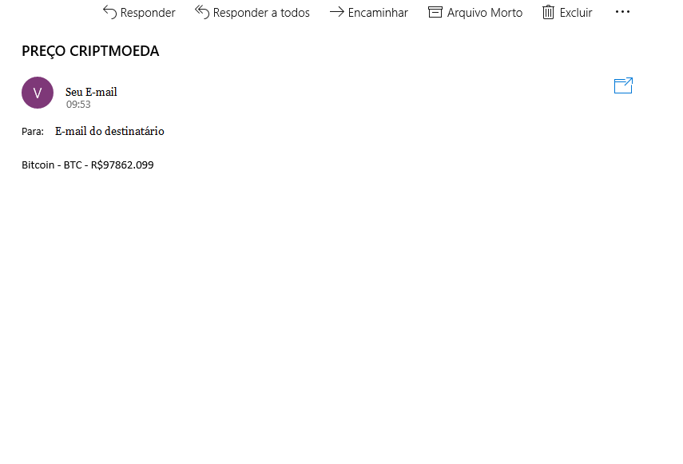

# Data-extraction-via-coinmarketcap-api
Data extraction via coinmarketcap api

<h1 align="center">Data extraction via coinmarketcap api</h1>


#### Índice

* [Descrição do projeto](#descrição-do-projeto)
* [Status do Projeto](#status-do-projeto)
* [Instalações](#instalações)
* [Funcionalidade e demonstração da aplicação](#funcionalidade-e-demonstração-da-aplicação)
* [Tecnologia utilizadas](#tecnologia-utilizadas)
* [Melhorias Futuras](#melhorias-futuras)
* [Desenvolvedor do projeto](#desenvolvedor-do-projeto)


### Descrição do projeto
Esse projeto foi desenvolvido para ficar analisando o preço da 
criptomoeda bitcoin automaticamente e caso o preço esteja igual 
ou abaixo do preço que foi estabelecido pelo o usuário, o script 
envia um email avisando sobre o preço do ativo. Esse projeto pode 
ser programado para executar toda vez que o windows inicializar e 
com isso rodará automaticamente. 


### Status do Projeto


### Instalações
Bibliotecas que precisa está instalada para iniciar a execução do projeto.

```
pip install pandas requests json smtplib
```

### Funcionalidade e demonstração da aplicação



### Tecnologia utilizadas
* [Python 3.10](https://www.python.org/downloads/) - Linguagem utilizada para criação do projeto.
* [Pandas](https://pandas.pydata.org/) - Biblioteca utilizada para manipulação dos dados
* [Requests](https://requests.readthedocs.io/en/latest/) - Biblioteca utilizada para conexão com a api
* [SMTPlib](https://docs.python.org/3/library/smtplib.html) - Biblioteca utilizada para enviar email

### Melhorias Futuras

- [ ] Histórico de preço;
- [ ] Salvamento dos valores em uma base de dados

### Desenvolvedor do projeto
[<br><sub>Vitor Souza</sub> ](https://github.com/vitorhssouza)


[](https://www.linkedin.com/in/vitorhugossouza/)
[](https://twitter.com/VitorHSSouza10)
[](https://www.facebook.com/vitorugoo.kta) 
[](https://www.instagram.com/viitorsouza10/) 
[](https://vitorhssouza.github.io/#home)
